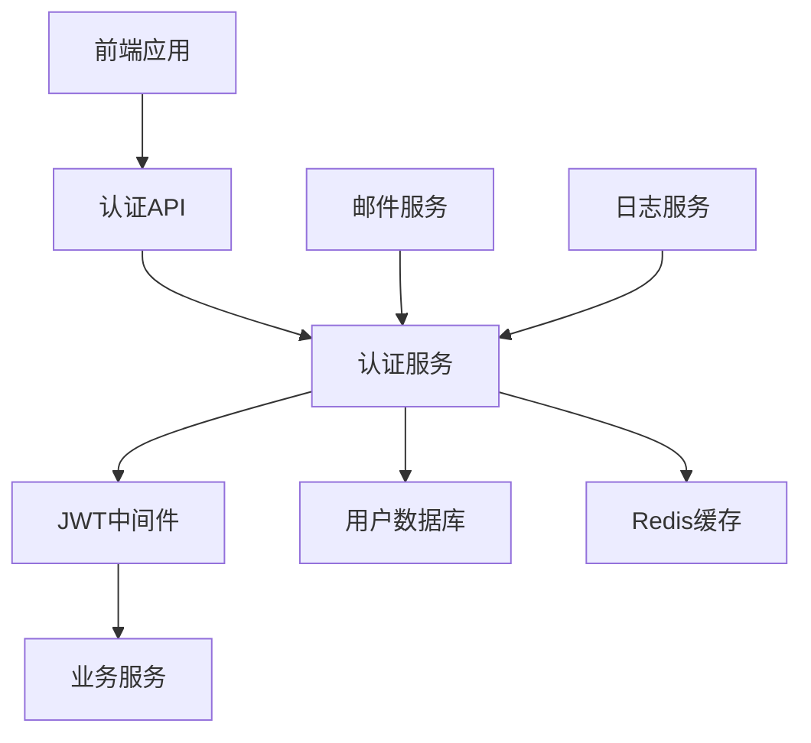
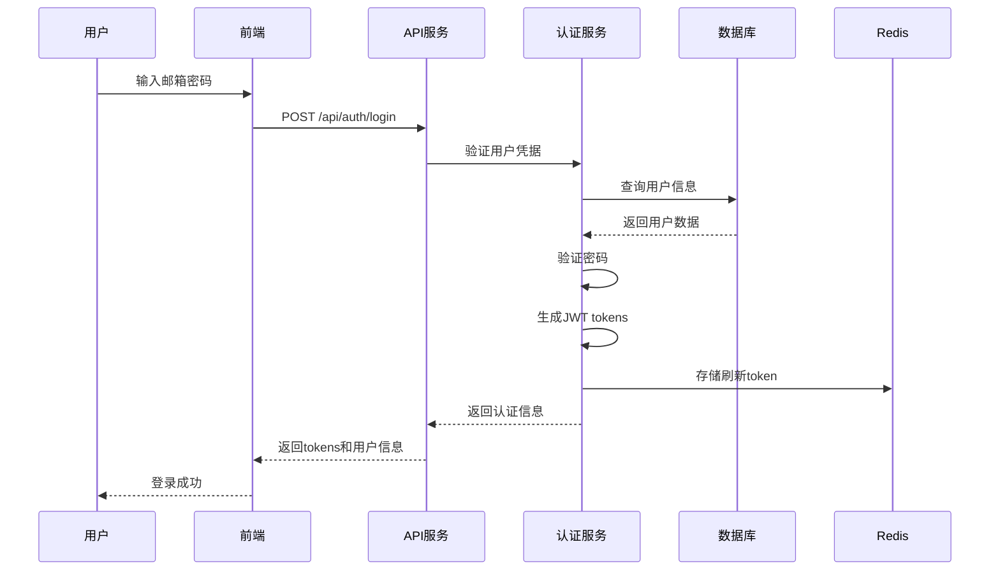
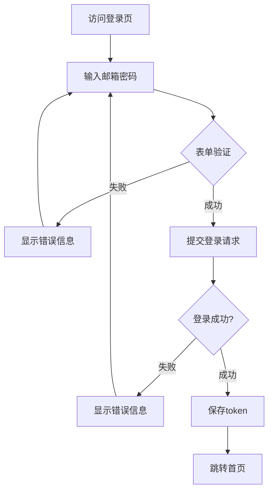
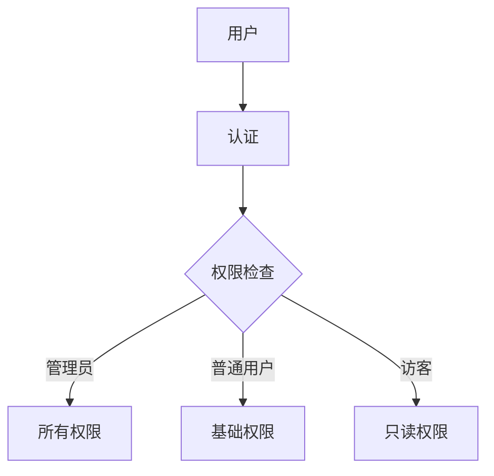

# 详细设计 - user-authentication

> **How** - 用户认证系统的技术实现方案

## 📋 设计概述

### 设计目标
构建安全、高效、可扩展的用户认证系统

### 设计原则
- **安全性第一**: 保护用户数据和系统安全
- **用户体验优先**: 简单易用的认证流程
- **性能可靠**: 高并发下稳定运行
- **易于扩展**: 支持未来功能扩展

## 🏗️ 系统设计

### 整体架构


### 核心组件

#### 1. 认证API层
**职责**: 处理HTTP请求，参数验证

**接口定义**:
```typescript
interface AuthAPI {
  register(email: string, password: string): Promise<AuthResponse>;
  login(email: string, password: string): Promise<AuthResponse>;
  logout(token: string): Promise<void>;
  verifyToken(token: string): Promise<UserInfo>;
  refreshToken(refreshToken: string): Promise<TokenResponse>;
}

interface AuthResponse {
  success: boolean;
  data?: {
    accessToken: string;
    refreshToken: string;
    user: UserInfo;
    expiresIn: number;
  };
  message?: string;
}
```

#### 2. 认证服务层
**职责**: 核心业务逻辑处理

```typescript
interface AuthService {
  registerUser(userData: RegisterData): Promise<User>;
  authenticateUser(email: string, password: string): Promise<AuthResult>;
  generateTokens(user: User): Promise<TokenPair>;
  validateToken(token: string): Promise<TokenPayload>;
  revokeToken(token: string): Promise<void>;
}
```

#### 3. JWT中间件
**职责**: Token验证和用户身份注入

## 🗄️ 数据模型设计

### 数据库设计

#### 用户表 (users)
```sql
CREATE TABLE users (
  id UUID PRIMARY KEY DEFAULT gen_random_uuid(),
  email VARCHAR(255) UNIQUE NOT NULL,
  password_hash VARCHAR(255) NOT NULL,
  full_name VARCHAR(100),
  is_active BOOLEAN DEFAULT true,
  is_verified BOOLEAN DEFAULT false,
  last_login TIMESTAMP,
  created_at TIMESTAMP DEFAULT CURRENT_TIMESTAMP,
  updated_at TIMESTAMP DEFAULT CURRENT_TIMESTAMP
);

CREATE INDEX idx_users_email ON users(email);
CREATE INDEX idx_users_active ON users(is_active);
```

#### 刷新令牌表 (refresh_tokens)
```sql
CREATE TABLE refresh_tokens (
  id UUID PRIMARY KEY DEFAULT gen_random_uuid(),
  user_id UUID NOT NULL REFERENCES users(id) ON DELETE CASCADE,
  token_hash VARCHAR(255) NOT NULL,
  expires_at TIMESTAMP NOT NULL,
  revoked_at TIMESTAMP,
  created_at TIMESTAMP DEFAULT CURRENT_TIMESTAMP
);

CREATE INDEX idx_refresh_tokens_user_id ON refresh_tokens(user_id);
CREATE INDEX idx_refresh_tokens_expires_at ON refresh_tokens(expires_at);
```

### 数据流设计


## 🔌 API设计

### RESTful API规范

#### 1. 用户注册
```http
POST /api/auth/register
Content-Type: application/json

{
  "email": "user@example.com",
  "password": "SecurePass123!",
  "fullName": "张三"
}
```

**响应格式**:
```json
{
  "success": true,
  "data": {
    "user": {
      "id": "uuid",
      "email": "user@example.com",
      "fullName": "张三",
      "isActive": true,
      "isVerified": false
    }
  },
  "message": "用户注册成功"
}
```

#### 2. 用户登录
```http
POST /api/auth/login
Content-Type: application/json

{
  "email": "user@example.com",
  "password": "SecurePass123!"
}
```

**响应格式**:
```json
{
  "success": true,
  "data": {
    "accessToken": "eyJhbGciOiJIUzI1NiIs...",
    "refreshToken": "eyJhbGciOiJIUzI1NiIs...",
    "user": {
      "id": "uuid",
      "email": "user@example.com",
      "fullName": "张三"
    },
    "expiresIn": 3600
  }
}
```

#### 3. 刷新Token
```http
POST /api/auth/refresh
Authorization: Bearer {refreshToken}
```

#### 4. 用户登出
```http
POST /api/auth/logout
Authorization: Bearer {accessToken}
```

### 认证中间件
```typescript
// 验证访问受保护的路由
app.use('/api/protected', authenticateToken, (req, res) => {
  // req.user 已注入用户信息
  res.json({ message: '访问成功', user: req.user });
});
```

## 🎨 前端设计

### 页面结构
```
src/features/auth/
├── components/
│   ├── LoginForm/
│   │   ├── LoginForm.tsx
│   │   ├── LoginForm.test.tsx
│   │   └── styles.module.css
│   ├── RegisterForm/
│   │   ├── RegisterForm.tsx
│   │   ├── RegisterForm.test.tsx
│   │   └── styles.module.css
│   └── ProtectedRoute/
│       ├── ProtectedRoute.tsx
│       └── ProtectedRoute.test.tsx
├── hooks/
│   ├── useAuth.ts
│   ├── useLogin.ts
│   └── useRegister.ts
├── services/
│   └── authService.ts
├── store/
│   └── authSlice.ts
└── types/
    └── auth.ts
```

#### 状态管理
```typescript
// Redux store for authentication
interface AuthState {
  user: User | null;
  isAuthenticated: boolean;
  isLoading: boolean;
  error: string | null;
  token: string | null;
}

const authSlice = createSlice({
  name: 'auth',
  initialState,
  reducers: {
    loginStart: (state) => {
      state.isLoading = true;
      state.error = null;
    },
    loginSuccess: (state, action) => {
      state.isAuthenticated = true;
      state.user = action.payload.user;
      state.token = action.payload.accessToken;
      state.isLoading = false;
    },
    loginFailure: (state, action) => {
      state.error = action.payload;
      state.isLoading = false;
    },
    logout: (state) => {
      state.isAuthenticated = false;
      state.user = null;
      state.token = null;
    }
  }
});
```

### 交互设计

#### 登录流程


## 🔒 安全设计

### 安全措施

#### 密码安全
```typescript
import bcrypt from 'bcrypt';

// 密码加密
export const hashPassword = async (password: string): Promise<string> => {
  const saltRounds = 12;
  return bcrypt.hash(password, saltRounds);
};

// 密码验证
export const verifyPassword = async (
  password: string,
  hash: string
): Promise<boolean> => {
  return bcrypt.compare(password, hash);
};
```

#### JWT安全
```typescript
// JWT 配置
const jwtConfig = {
  secret: process.env.JWT_SECRET || 'your-secret-key',
  accessTokenExpiry: '15m',
  refreshTokenExpiry: '7d',
  algorithm: 'HS256'
};

// 生成访问令牌
export const generateAccessToken = (payload: any): string => {
  return jwt.sign(payload, jwtConfig.secret, {
    expiresIn: jwtConfig.accessTokenExpiry,
    algorithm: jwtConfig.algorithm as Algorithm
  });
};
```

#### 安全最佳实践
- **密码策略**: 最少8位，包含大小写字母、数字和特殊字符
- **速率限制**: 登录失败5次后锁定10分钟
- **HTTPS强制**: 生产环境强制使用HTTPS
- **CSRF保护**: 使用CSRF token
- **输入验证**: 严格验证所有输入

### 权限模型


## 🧪 测试策略

### 单元测试 (70%)
- 工具: Jest + React Testing Library
- 覆盖目标: 90%
- 测试内容:
  - 认证服务函数
  - JWT工具函数
  - 密码加密/验证
  - React组件

### 集成测试 (20%)
- 工具: Supertest + Jest
- 测试内容:
  - API端点测试
  - 数据库集成
  - 认证流程

### 端到端测试 (10%)
- 工具: Playwright
- 测试内容:
  - 完整登录流程
  - 受保护页面访问
  - Token刷新

## 📊 性能设计

### 性能目标
| 指标 | 目标值 | 测量方式 |
|------|--------|----------|
| 登录响应时间 | < 500ms | API监控 |
| Token验证时间 | < 50ms | 性能测试 |
| 并发用户数 | > 1000 | 负载测试 |
| 系统可用性 | > 99.9% | 监控告警 |

### 性能优化策略
- **数据库优化**: 为邮箱字段创建索引
- **缓存策略**: Redis缓存用户会话
- **JWT优化**: 使用RS256算法提高性能
- **连接池**: 数据库连接池管理

## 🚀 部署设计

### 环境配置
```yaml
# development.yml
database:
  host: localhost
  port: 5432
  database: auth_dev

redis:
  host: localhost
  port: 6379
  db: 0

jwt:
  secret: dev-secret
  accessTokenExpiry: 15m
  refreshTokenExpiry: 7d
```

```yaml
# production.yml
database:
  host: ${DB_HOST}
  port: 5432
  database: ${DB_NAME}
  ssl: true

redis:
  host: ${REDIS_HOST}
  port: 6379
  password: ${REDIS_PASSWORD}

jwt:
  secret: ${JWT_SECRET}
  accessTokenExpiry: 15m
  refreshTokenExpiry: 7d
```

### CI/CD流水线
```yaml
name: Auth Service CI/CD
on:
  push:
    branches: [main, develop]
  pull_request:
    branches: [main]

jobs:
  test:
    runs-on: ubuntu-latest
    steps:
      - uses: actions/checkout@v3
      - name: Setup Node.js
        uses: actions/setup-node@v3
        with:
          node-version: '18'
      - name: Install dependencies
        run: npm ci
      - name: Run tests
        run: npm test
      - name: Run security audit
        run: npm audit --audit-level high

  deploy:
    needs: test
    if: github.ref == 'refs/heads/main'
    runs-on: ubuntu-latest
    steps:
      - name: Deploy to production
        run: |
          docker build -t auth-service .
          docker push ${{ secrets.REGISTRY }}/auth-service
          kubectl apply -f k8s/
```

## 📈 监控设计

### 监控指标
- **业务指标**:
  - 登录成功率
  - 注册转化率
  - 平均登录时间

- **技术指标**:
  - API响应时间
  - 错误率
  - Token生成速率

### 告警规则
```yaml
alerts:
  - name: HighLoginFailureRate
    condition: login_failure_rate > 10%
    severity: critical
    notification: slack + email

  - name: AuthResponseTimeHigh
    condition: auth_response_time > 1s
    severity: warning
    notification: slack
```

## 🔄 迁移计划

### 从现有系统迁移
1. **数据迁移**:
   - 创建新用户表
   - 迁移现有用户数据
   - 加密现有密码

2. **代码迁移**:
   - 保留旧API兼容性
   - 逐步替换认证逻辑
   - 测试回退方案

## 📚 附录

### 依赖包清单
```json
{
  "dependencies": {
    "express": "^4.18.0",
    "jsonwebtoken": "^9.0.0",
    "bcrypt": "^5.1.0",
    "pg": "^8.8.0",
    "redis": "^4.6.0",
    "joi": "^17.7.0"
  },
  "devDependencies": {
    "jest": "^29.3.0",
    "supertest": "^6.3.0",
    "playwright": "^1.28.0"
  }
}
```

---

*设计版本: 1.0*
*最后更新: 2024-12-16*
*设计负责人: 开发团队*