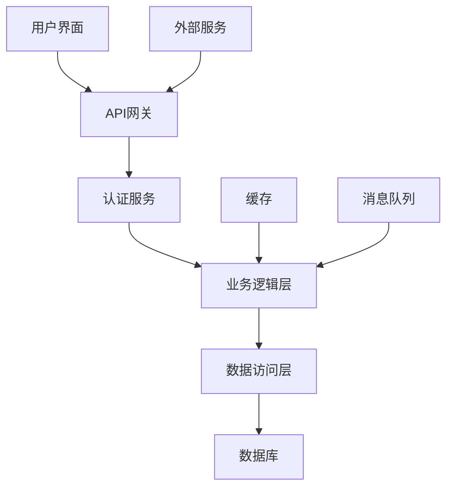
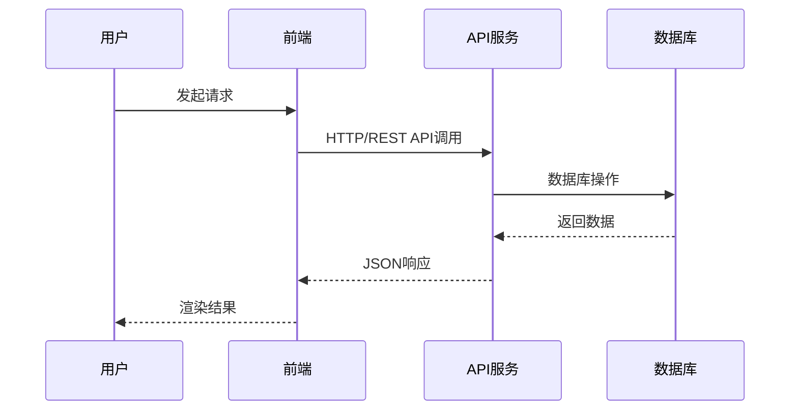
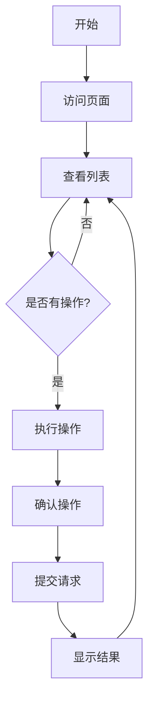
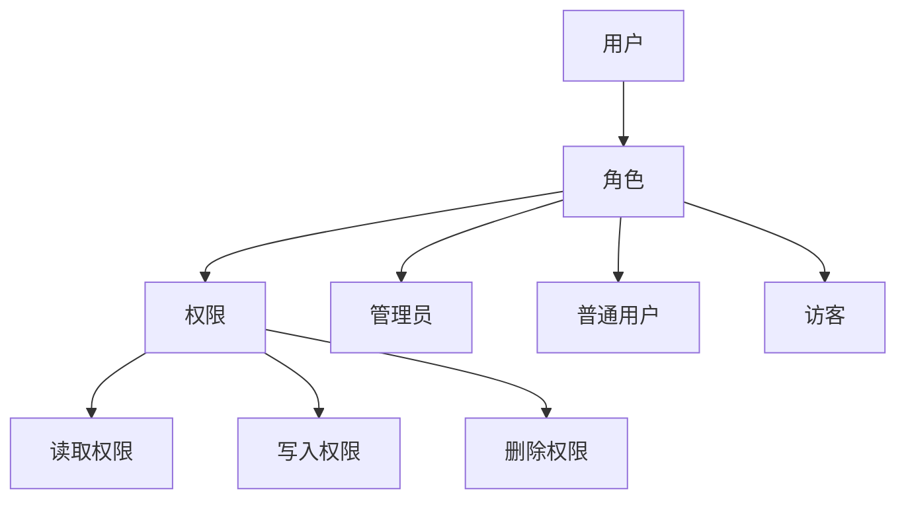
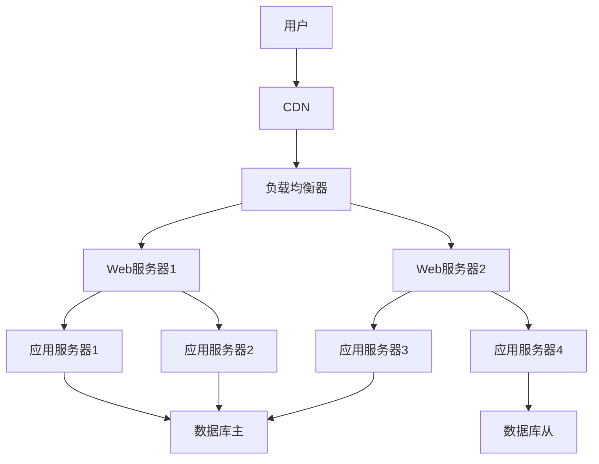

# 详细设计 - {FEATURE_NAME}

> **How** - 功能的技术实现方案

## 📋 设计概述

### 设计目标
{DESIGN_GOALS}

### 设计原则
{DESIGN_PRINCIPLES}
- **原则1**: {PRINCIPLE_1}
- **原则2**: {PRINCIPLE_2}
- **原则3**: {PRINCIPLE_3}

## 🏗️ 系统设计

### 整体架构
{SYSTEM_ARCHITECTURE}



### 核心组件
{CORE_COMPONENTS}

#### 1. {COMPONENT_1_NAME}
**职责**: {COMPONENT_1_RESPONSIBILITY}

**接口定义**:
```typescript
interface {COMPONENT_1_INTERFACE} {
  {METHOD_1}(): {RETURN_TYPE_1};
  {METHOD_2}({PARAM_1}: {TYPE_1}): {RETURN_TYPE_2};
}
```

**实现要点**:
- {IMPLEMENTATION_DETAIL_1}
- {IMPLEMENTATION_DETAIL_2}

#### 2. {COMPONENT_2_NAME}
**职责**: {COMPONENT_2_RESPONSIBILITY}

**接口定义**:
```typescript
interface {COMPONENT_2_INTERFACE} {
  {METHOD_3}(): {RETURN_TYPE_3};
  {METHOD_4}({PARAM_2}: {TYPE_2}): {RETURN_TYPE_4};
}
```

## 🗄️ 数据模型设计

### 数据库设计

#### 表结构
{DATABASE_TABLES}

**{TABLE_1_NAME}**
```sql
CREATE TABLE {TABLE_1_NAME} (
  {COLUMN_1} {TYPE_1} {CONSTRAINT_1},
  {COLUMN_2} {TYPE_2} {CONSTRAINT_2},
  {COLUMN_3} {TYPE_3} {CONSTRAINT_3},
  PRIMARY KEY ({PRIMARY_KEY}),
  INDEX {INDEX_NAME} ({INDEX_COLUMN})
);
```

**字段说明**:
- `{COLUMN_1}`: {COLUMN_1_DESCRIPTION}
- `{COLUMN_2}`: {COLUMN_2_DESCRIPTION}
- `{COLUMN_3}`: {COLUMN_3_DESCRIPTION}

#### 数据关系图
{RELATIONSHIP_DIAGRAM}

```mermaid
erDiagram
    {TABLE_1_NAME} ||--o{ {TABLE_2_NAME} : {RELATIONSHIP_1}
    {TABLE_2_NAME} ||--o{ {TABLE_3_NAME} : {RELATIONSHIP_2}
```

### 数据流设计
{DATA_FLOW_DESIGN}



## 🔌 API设计

### RESTful API规范
{API_DESIGN}

#### 端点定义
{API_ENDPOINTS}

**1. {ENDPOINT_1}**
```http
{METHOD_1} /api/v1/{PATH_1}
```

**请求参数**:
| 参数 | 类型 | 必填 | 描述 |
|------|------|------|------|
| {PARAM_1} | {TYPE_1} | 是 | {PARAM_1_DESC} |
| {PARAM_2} | {TYPE_2} | 否 | {PARAM_2_DESC} |

**响应格式**:
```json
{
  "success": true,
  "data": {
    "id": "{FIELD_1}",
    "name": "{FIELD_2}"
  },
  "message": "操作成功"
}
```

**错误处理**:
```json
{
  "success": false,
  "error": {
    "code": "ERROR_CODE",
    "message": "错误描述",
    "details": "详细错误信息"
  }
}
```

**2. {ENDPOINT_2}**
```http
{METHOD_2} /api/v1/{PATH_2}/{PARAM_ID}
```

### 认证授权
{AUTH_DESIGN}

- **认证方式**: {AUTH_METHOD}
- **授权模式**: {AUTHORIZATION_MODE}
- **Token管理**: {TOKEN_MANAGEMENT}

## 🎨 前端设计

### 页面结构
{FRONTEND_STRUCTURE}

#### 页面组件树
{COMPONENT_TREE}
```
{FEATURE_NAME}Page/
├── components/
│   ├── {COMPONENT_1}/
│   │   ├── {COMPONENT_1}.tsx
│   │   ├── {COMPONENT_1}.test.tsx
│   │   └── {COMPONENT_1}.css
│   ├── {COMPONENT_2}/
│   │   ├── {COMPONENT_2}.tsx
│   │   ├── {COMPONENT_2}.test.tsx
│   │   └── {COMPONENT_2}.css
│   └── {COMPONENT_3}/
├── hooks/
│   ├── {HOOK_1}.ts
│   └── {HOOK_2}.ts
├── services/
��   └── {SERVICE_NAME}.ts
├── types/
│   └── {TYPE_DEFINITION}.ts
└── utils/
    └── {UTILITY}.ts
```

#### 状态管理
{STATE_MANAGEMENT}

**全局状态**:
```typescript
interface {GLOBAL_STATE} {
  {STATE_FIELD_1}: {TYPE_1};
  {STATE_FIELD_2}: {TYPE_2};
  loading: boolean;
  error: string | null;
}
```

**组件状态**:
```typescript
interface {COMPONENT_STATE} {
  {COMPONENT_FIELD_1}: {TYPE_3};
  {COMPONENT_FIELD_2}: {TYPE_4};
}
```

### 交互设计
{INTERACTION_DESIGN}

#### 用户流程图
{USER_FLOW}



#### 关键交互
{KEY_INTERACTIONS}

**交互1**: {INTERACTION_1}
- **触发条件**: {TRIGGER_1}
- **用户操作**: {USER_ACTION_1}
- **系统响应**: {SYSTEM_RESPONSE_1}
- **反馈机制**: {FEEDBACK_1}

**交互2**: {INTERACTION_2}
- **触发条件**: {TRIGGER_2}
- **用户操作**: {USER_ACTION_2}
- **系统响应**: {SYSTEM_RESPONSE_2}
- **反馈机制**: {FEEDBACK_2}

## 🔒 安全设计

### 安全措施
{SECURITY_MEASURES}

#### 认证安全
{AUTH_SECURITY}
- **密码策略**: {PASSWORD_POLICY}
- **会话管理**: {SESSION_MANAGEMENT}
- **多因素认证**: {MFA_IMPLEMENTATION}

#### 数据安全
{DATA_SECURITY}
- **加密存储**: {ENCRYPTION_AT_REST}
- **传输加密**: {ENCRYPTION_IN_TRANSIT}
- **敏感数据处理**: {SENSITIVE_DATA_HANDLING}

#### API安全
{API_SECURITY}
- **输入验证**: {INPUT_VALIDATION}
- **输出编码**: {OUTPUT_ENCODING}
- **访问控制**: {ACCESS_CONTROL}
- **速率限制**: {RATE_LIMITING}

### 权限模型
{PERMISSION_MODEL}



## 🧪 测试策略

### 测试金字塔
{TEST_PYRAMID}

#### 单元测试 (70%)
{UNIT_TESTS}
- **覆盖率目标**: {COVERAGE_TARGET}%
- **测试工具**: {UNIT_TEST_FRAMEWORK}
- **测试内容**:
  - 业务逻辑函数
  - 组件单元测试
  - 工具函数测试

#### 集成测试 (20%)
{INTEGRATION_TESTS}
- **测试工具**: {INTEGRATION_TEST_FRAMEWORK}
- **测试内容**:
  - API集成测试
  - 组件集成测试
  - 数据库集成测试

#### 端到端测试 (10%)
{E2E_TESTS}
- **测试工具**: {E2E_TEST_FRAMEWORK}
- **测试内容**:
  - 关键用户路径
  - 跨浏览器测试
  - 性能测试

### 测试环境
{TEST_ENVIRONMENTS}

| 环境 | 用途 | 数据源 | 访问地址 |
|------|------|--------|----------|
| 开发环境 | 开发调试 | 本地数据库 | localhost |
| 测试环境 | 功能验证 | 测试数据 | test.example.com |
| 预发环境 | 上线前验证 | 生产快照 | staging.example.com |

## 📊 性能设计

### 性能目标
{PERFORMANCE_TARGETS}

| 指标 | 目标值 | 测量方式 |
|------|--------|----------|
| 响应时间 | < {RESPONSE_TIME}ms | API监控 |
| 吞吐量 | > {THROUGHPUT} req/s | 压力测试 |
| 并发用户 | > {CONCURRENT_USERS} | 负载测试 |
| 可用性 | > {AVAILABILITY}% | 监控告警 |

### 性能优化策略
{PERFORMANCE_OPTIMIZATION}

#### 前端优化
{FRONTEND_OPTIMIZATION}
- **代码分割**: {CODE_SPLITTING}
- **懒加载**: {LAZY_LOADING}
- **缓存策略**: {CACHING_STRATEGY}
- **资源压缩**: {RESOURCE_COMPRESSION}

#### 后端优化
{BACKEND_OPTIMIZATION}
- **数据库优化**: {DATABASE_OPTIMIZATION}
- **缓存层**: {CACHE_LAYER}
- **异步处理**: {ASYNC_PROCESSING}
- **连接池**: {CONNECTION_POOL}

## 🚀 部署设计

### 部署架构
{DEPLOYMENT_ARCHITECTURE}



### 部署流程
{DEPLOYMENT_PROCESS}

#### CI/CD流水线
{CI_CD_PIPELINE}

```yaml
# .github/workflows/deploy.yml
name: Deploy {FEATURE_NAME}
on:
  push:
    branches: [main]

jobs:
  test:
    runs-on: ubuntu-latest
    steps:
      - uses: actions/checkout@v3
      - name: Run tests
        run: npm test

  build:
    needs: test
    runs-on: ubuntu-latest
    steps:
      - name: Build application
        run: npm run build

  deploy:
    needs: build
    runs-on: ubuntu-latest
    steps:
      - name: Deploy to production
        run: kubectl apply -f deployment.yaml
```

### 环境配置
{ENVIRONMENT_CONFIG}

#### 开发环境
{DEV_ENV_CONFIG}
```yaml
# config/dev.yml
database:
  host: localhost
  port: 5432
  name: {DB_NAME}_dev

api:
  port: 8080
  debug: true
```

#### 生产环境
{PROD_ENV_CONFIG}
```yaml
# config/prod.yml
database:
  host: ${DB_HOST}
  port: 5432
  name: ${DB_NAME}

api:
  port: 8080
  debug: false
```

## 📈 监控设计

### 监控指标
{MONITORING_METRICS}

#### 业务指标
{BUSINESS_METRICS}
- **用户活跃度**: {USER_ACTIVITY_METRIC}
- **功能使用率**: {FEATURE_USAGE_METRIC}
- **错误率**: {ERROR_RATE_METRIC}

#### 技术指标
{TECHNICAL_METRICS}
- **响应时间**: {RESPONSE_TIME_METRIC}
- **CPU使用率**: {CPU_METRIC}
- **内存使用率**: {MEMORY_METRIC}
- **数据库性能**: {DB_METRIC}

### 告警策略
{ALERT_STRATEGY}

| 告警项 | 阈值 | 级别 | 通知方式 |
|--------|------|------|----------|
| 错误率 | > 5% | 高 | 短信+邮件 |
| 响应时间 | > 1s | 中 | 邮件 |
| CPU使用率 | > 80% | 中 | 邮件 |
| 磁盘使用率 | > 90% | 高 | 短信+邮件 |

## 🔄 迁移计划

### 数据迁移
{DATA_MIGRATION}

#### 迁移步骤
{MIGRATION_STEPS}
1. **准备阶段**: {PREPARATION_PHASE}
   - 数据备份
   - 迁移脚本编写
   - 回滚方案准备

2. **执行阶段**: {EXECUTION_PHASE}
   - 停止服务
   - 执行迁移脚本
   - 验证数据完整性

3. **验证阶段**: {VALIDATION_PHASE}
   - 启动服务
   - 功能验证
   - 性能验证

### 回滚方案
{ROLLBACK_PLAN}
- **触发条件**: {ROLLBACK_TRIGGERS}
- **回滚步骤**: {ROLLBACK_STEPS}
- **验证方法**: {ROLLBACK_VALIDATION}

## 📚 附录

### 术语表
{GLOSSARY}

| 术语 | 定义 |
|------|------|
| {TERM_1} | {DEFINITION_1} |
| {TERM_2} | {DEFINITION_2} |

### 参考资料
{REFERENCES}
- [参考文档1]({REFERENCE_1_URL})
- [参考文档2]({REFERENCE_2_URL})

### 设计决策记录
{DESIGN_DECISIONS}

| 决策ID | 决策内容 | 日期 | 决策人 |
|--------|----------|------|--------|
| DEC-001 | {DECISION_1} | {DATE_1} | {DECIDER_1} |
| DEC-002 | {DECISION_2} | {DATE_2} | {DECIDER_2} |

---

*设计版本: {DESIGN_VERSION}*
*最后更新: {LAST_UPDATE_DATE}*
*设计负责人: {DESIGN_OWNER}*